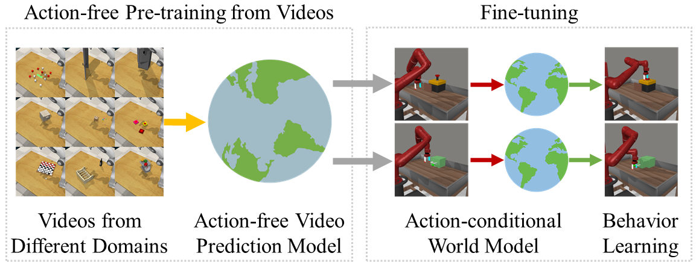

# Reinforcement Learning with Action-Free Pre-Training from Videos

Implementation of the [APV](https://arxiv.org/abs/2203.13880) in TensorFlow 2. Our code is based on the implementation of [DreamerV2](https://github.com/danijar/dreamerv2). We also provide the raw data we used for reporting our main experimental results in `data` directory.

If you find this code useful, please reference in our paper:

```
@article{seo2022reinforce,
  title={Reinforcement Learning with Action-Free Pre-Training from Videos},
  author={Seo, Younggyo and Lee, Kimin and James, Stephen and Abbeel, Pieter},
  journal={arXiv preprint arXiv:2203.xxxxx},
  year={2022}
}
```

Please also cite DreamerV2 paper on top of which APV is built:

```
@article{hafner2020dreamerv2,
  title={Mastering Atari with Discrete World Models},
  author={Hafner, Danijar and Lillicrap, Timothy and Norouzi, Mohammad and Ba, Jimmy},
  journal={arXiv preprint arXiv:2010.02193},
  year={2020}
}
```

## Method
APV is a pre-training and fine-tuning framework for model-based RL algorithms: we first pre-train an action-free latent video prediction model, and then utilize the pre-trained representations for efficiently learning action-conditional world models on unseen environments.




## Resources

Get resources you need in below links:
- [Pre-trained models](https://drive.google.com/drive/folders/1cDjLreFqw-LCJ48Bt80Dh1Ypo1LHqWP1)
- [Datasets used for pre-training](https://drive.google.com/drive/folders/1Qk9fvC1OGxrbVFGm0zrPmAmV8lu4_l8D) (download this if you want to run pre-training by yourself)


## Instructions

Get dependencies:
```
pip install tensorflow==2.6.0 tensorflow_text==2.6.0 tensorflow_estimator==2.6.0 tensorflow_probability==0.14.1 ruamel.yaml 'gym[atari]' dm_control git+https://github.com/rlworkgroup/metaworld.git@a0009ed9a208ff9864a5c1368c04c273bb20dd06#egg=metaworld
```

Run video pre-training (if you want to run pre-training by yourself):

```
python apv_pretraining/train_video.py --logdir {save path} --load_logdir {dataset path consisting of npzs} --configs metaworld_pretrain
```

Run Meta-world experiments:

```
python apv_finetuning/train.py --logdir {save path} --load_logdir {path to the pre-trained models} --configs metaworld --task metaworld_lever_pull
```

Run DeepMind Control Suite experiments:

```
python apv_finetuning/train.py --logdir {save path} --load_logdir {path to the pre-trained models} --configs dmc_vision --task dmc_quadruped_walk
```

## Tips

- Use `TF_XLA_FLAGS=--tf_xla_auto_jit=2 ` to accelerate the training. This requires properly setting your CUDA and CUDNN paths in our machine. You can check this whether `which ptxas` gives you a path to the CUDA/bin path in your machine.

- Also see the tips available in [DreamerV2 repository](https://github.com/danijar/dreamerv2/blob/main/README.md#tips).
